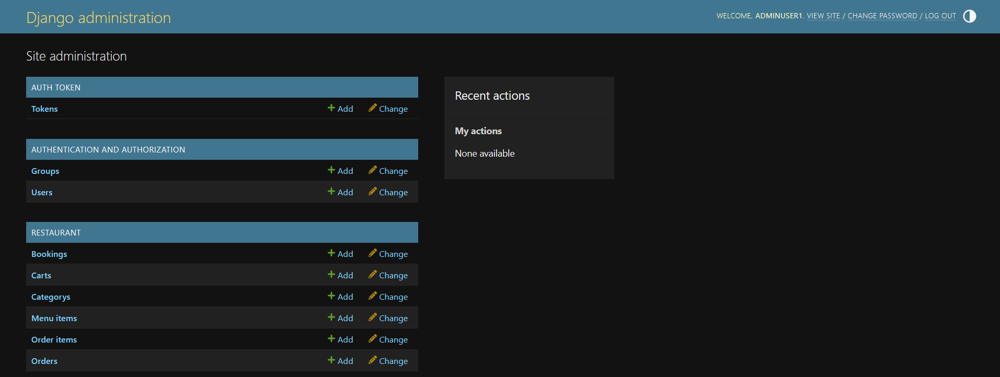

# Little Lemon Restaurant Web Application

## Overview

A web app for the Little Lemon restaurant as per the Meta Backend Developer Course. The user facing web app contains an about page introducing the Little Lemon restaurant, a series of menu item pages describing the dishes available to order, and a booking page for reserving a table at the restaurant.
* http://localhost:8000/


The web app also includes a REST API for interacting with backend data model. These include the user facing menu items and booking pages described above. The backend api also includes administrative endpoints for controlling users, orders and deliveries.
* http://localhost:8000/api/


The built-in django admin page is available at for tokens, authentication and data model operations.
* http://localhost:8000/admin/



## Data Model

The underlying data model present in the Little Lemon Restaurant Web App is displayed below. 


For a more detailed account of each column in the dataset see the data dictionary:

* https://github.com/oislen/LittleLemon/blob/main/doc/data_dictionary.xlsx

## Running the Application (Windows)

### Docker

The latest version of the Little Lemon Web App can be found as a [docker](https://www.docker.com/) image on dockerhub here:

* https://hub.docker.com/repository/docker/oislen/littlelemondjango/general

The image can be pulled from dockerhub using the following command:

```
docker pull oislen/littlelemondjango:latest
```

The Little Lemon Web App can then be started using the following command and the docker image:

```
docker compose up
```

Once the web app is running, navigate to localhost:8000 in your preferred browser

* http://localhost:8000
