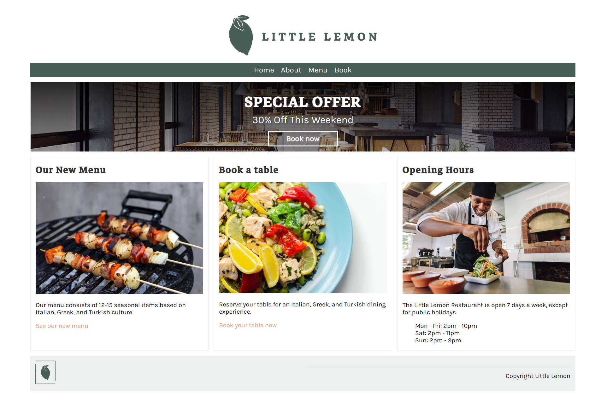
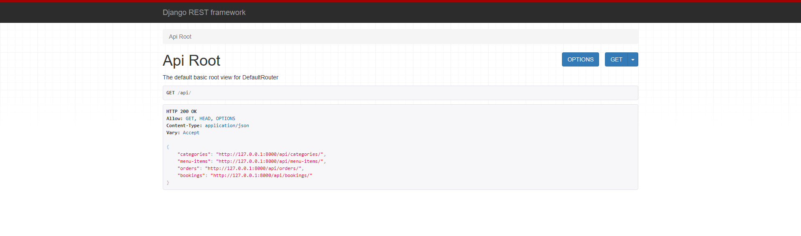

# Little Lemon Restaurant Web Application

## Overview

A web app for the Little Lemon restaurant as per the Meta Backend Developer Course. The user facing web app contains an about page introducing the Little Lemon restaurant, a series of menu item pages describing the dishes available to order, and a booking page for reserving a table at the restaurant.
* http://localhost:8000/



The web app also includes a REST API for interacting with backend data model. These include the user facing menu items and booking pages described above. The backend api also includes administrative endpoints for controlling users, orders and deliveries.
* http://localhost:8000/api/



The built-in django admin page is available at for tokens, authentication and data model operations.
* http://localhost:8000/admin/


## Features

* **Customer-facing site** &mdash; home, about, menu, individual menu item, and table booking pages rendered with Django templates.
* **REST API** &mdash; full CRUD endpoints for categories, menu items, bookings, orders and users, served via Django REST Framework.
* **Role-based workflows** &mdash; administrators promote users to the *Manager* group, managers assign orders to *Delivery Crew*, and delivery crew mark their assigned orders as delivered.
* **Token & JWT authentication** &mdash; provided through Djoser, DRF token auth and Simple JWT.
* **Content negotiation** &mdash; responses can be rendered as JSON, the browsable API, or XML.
* **MCP server** &mdash; a companion Model Context Protocol server exposes the API as resources and tools for LLM clients.
* **Seed data** &mdash; CSV fixtures are loaded via a `runscript` import to populate the database for development.

## Tech Stack

| Area | Technology |
| --- | --- |
| Language | Python 3.12 |
| Web framework | Django 6.0, Django REST Framework 3.16 |
| Auth | Djoser, DRF Token Auth, Simple JWT |
| Data tooling | pandas / numpy (CSV seed loading) |
| MCP | FastMCP / `mcp` (SSE transport) |
| Packaging | [uv](https://docs.astral.sh/uv/) (`pyproject.toml` / `uv.lock`) |
| Linting | Ruff |
| Container | Docker / Docker Compose |
| CI/CD | GitHub Actions (Ruff, Trivy, unit tests, Docker Hub publish) |

## Project Structure

A rough overview of the repository layout:

```
LittleLemonDjango/
├── littlelemon/                  # Django project root
│   ├── manage.py
│   ├── littlelemon/              # Project settings package
│   │   ├── settings.py           # Settings (DRF, JWT, CORS, DB)
│   │   ├── urls.py               # Root URL routing
│   │   ├── asgi.py / wsgi.py
│   ├── restaurant/               # Core "Little Lemon" app
│   │   ├── models.py             # Category, MenuItem, Booking, Cart, Order, OrderItem
│   │   ├── views.py              # Server-rendered pages (home, about, book, menu)
│   │   ├── forms.py              # BookingForm
│   │   ├── urls.py
│   │   ├── import_data.py        # CSV seed loader (runscript)
│   │   ├── templates/            # HTML templates (+ partials)
│   │   └── static/               # css / img / data (seed CSVs)
│   ├── api/                      # REST API app (Django REST Framework)
│   │   ├── serializers.py        # Model serializers (+ Cart price calc)
│   │   ├── views.py              # ViewSets and custom admin/delivery views
│   │   ├── permissions.py        # IsManager, IsDeliveryCrew
│   │   └── urls.py               # Router + custom endpoints
│   ├── tests/                    # Test suite
│   │   ├── tests.py              # API, view, model, serializer & permission tests
│   │   └── mixins.py             # Reusable test data factories
│   └── exeUnitTests.cmd          # Convenience script to run the test suite
├── mcp/
│   └── mcp_server.py             # FastMCP server exposing the Django API
├── postman/                      # Postman collections for the API
├── config/                       # conda / uv environment setup helpers
├── doc/                          # Diagrams, screenshots, data dictionary
├── .github/workflows/            # CI/CD pipelines (dev PRs, main deploy)
├── compose.yaml                  # Docker Compose (web + mcp services)
├── Dockerfile
├── exeDocker.cmd                 # Build & run the Docker image (Windows)
├── pyproject.toml / uv.lock      # uv project + locked dependencies
└── requirements.txt
```

> Note: database migrations are generated at build/run time (`makemigrations` + `migrate`), so the `migrations/` folders are not committed.

## Data Model

The underlying data model present in the Little Lemon Restaurant Web App is displayed below. 


For a more detailed account of each column in the dataset see the data dictionary:

* https://github.com/oislen/LittleLemon/blob/main/doc/data_dictionary.xlsx

## REST API Endpoints

All API routes are served under the `/api/` prefix.

| Method(s) | Endpoint | Description | Access |
| --- | --- | --- | --- |
| GET / POST / PUT / PATCH / DELETE | `/api/categories/` | Menu categories CRUD | Authenticated |
| GET / POST / PUT / PATCH / DELETE | `/api/menu-items/` | Menu items CRUD | Authenticated |
| GET / POST / PUT / PATCH / DELETE | `/api/bookings/` | Table bookings CRUD | Authenticated |
| GET / POST / PUT / PATCH / DELETE | `/api/orders/` | Customer orders CRUD | Authenticated |
| GET / POST / PUT / PATCH / DELETE | `/api/users/` | User accounts CRUD | Authenticated |
| POST | `/api/assign-manager/` | Add a user to the *Manager* group | Admin |
| POST | `/api/assign-delivery-crew/` | Assign an order to a delivery crew member | Manager |
| GET | `/api/delivery-orders/` | List the caller's pending deliveries | Delivery Crew |
| PATCH | `/api/delivery-orders/<order_id>/` | Mark an assigned order as delivered | Delivery Crew |

Authentication tokens can be obtained through the Djoser / Simple JWT routes (`/auth/...`) and the DRF token endpoint (`/api-token-auth`). Ready-made request collections are available in the [`postman/`](postman) directory.

## Running the Application (Windows)

### Docker

The latest version of the Little Lemon Web App can be found as a [docker](https://www.docker.com/) image on dockerhub here:

* https://hub.docker.com/repository/docker/oislen/littlelemondjango/general

The image can be pulled from dockerhub using the following command:

```
docker pull oislen/littlelemondjango:latest
```

The Little Lemon Web App can then be started using the following commands and the docker image:

```
docker network create littlelemon
docker run --name littlelemondjango --network littlelemon --publish 8000:8000 --workdir /home/user/LittleLemonDjango/littlelemon --memory 6g --shm-size 512m --rm oislen/littlelemondjango:latest uv run python manage.py runserver 0.0.0.0:8000
docker run --name llm --network littlelemon --publish 8585:8585 --workdir /home/user/LittleLemonDjango/mcp --env DJANGO_API_URL=http://littlelemondjango:8000/api --rm oislen/littlelemondjango:latest uv run python mcp_server.py
```

Once the web app is running, navigate to localhost:8000 in your preferred browser

* http://localhost:8000

The above docker commands starts two services: the Django web app on port `8000` and the companion MCP server on port `8585`. To rebuild the image locally from source, run the `exeDocker.cmd` helper script.

### Local Development (uv)

The project uses [uv](https://docs.astral.sh/uv/) for dependency management. With uv installed, run the following from the `littlelemon` directory:

```
cd littlelemon
uv sync                                              # install locked dependencies
uv run python manage.py makemigrations restaurant    # create migrations
uv run python manage.py migrate                       # apply migrations
uv run python manage.py runscript restaurant.import_data  # seed sample data
uv run python manage.py runserver                     # start the dev server
```

The development server is then available at http://localhost:8000.

### Seeding Data

Sample data is shipped as CSV files under `littlelemon/restaurant/static/data/` (categories, menu items, bookings, users, orders and order items). The [`import_data.py`](littlelemon/restaurant/import_data.py) script reads these files and populates the database via `manage.py runscript restaurant.import_data` (provided by `django-extensions`).

## Running the Tests

The test suite lives in [`littlelemon/tests/`](littlelemon/tests) and covers the REST API endpoints, server-rendered views, models, serializers, custom permissions and the role-based delivery workflow.

```
cd littlelemon
uv run python manage.py test
```

A convenience script, [`exeUnitTests.cmd`](littlelemon/exeUnitTests.cmd), runs the same command.

## MCP Server

The [`mcp/mcp_server.py`](mcp/mcp_server.py) module implements a [FastMCP](https://github.com/jlowin/fastmcp) server that wraps the Django REST API, exposing it as **resources** (bulk read-only lists of categories, menu items, bookings, orders and users) and **tools** (parameterised reads and create actions). It targets the API at the `DJANGO_API_URL` environment variable (default `http://127.0.0.1:8000/api`) and serves over SSE on port `8585`.

```
cd mcp
uv run python mcp_server.py
# inspect locally:
uv run fastmcp dev inspector mcp_server.py
# connect a client:
uv run ollmcp --mcp-server-url http://localhost:8585/sse
```

## Code Quality & CI/CD

* **Linting/formatting:** [Ruff](https://docs.astral.sh/ruff/) is configured in `pyproject.toml` (line length 88, targeting Python 3.12).
* **GitHub Actions:** two workflows live in [`.github/workflows/`](.github/workflows):
  * `dev-pull-requests.yml` &mdash; on PRs to `dev`/`main`, runs Ruff, a Trivy filesystem vulnerability scan, and the Django unit tests.
  * `deploy-main-push.yml` &mdash; on pushes to `main`, runs Ruff and tests, tags the release, builds and pushes the Docker image to Docker Hub, and runs Trivy filesystem and image scans.

## License

This project is distributed under the terms of the [LICENSE](LICENSE) file in the repository root.
